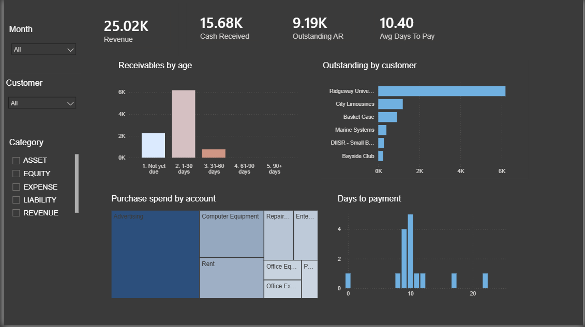

# Xero Finance Analytics Pipeline

[](https://github.com/kleanthispap/finance_analytics_pipeline/actions/workflows/dbt.yml)

An end-to-end analytics engineering pipeline over live accounting data: OAuth 2.0
API ingestion into BigQuery, dimensional modelling in dbt, and automated testing
on every push.

Source data is Xero's **Demo Company** — a fictional dataset Xero provides for
development. No real financial data is involved.

---

## Architecture

```
Xero Accounting API  (OAuth 2.0 authorisation code flow, read-only scopes)
        |
        v
src/ingest.py        pagination, rate-limit throttling, token refresh
        |
        v
BigQuery  xero_raw   8 tables, unmodified JSON payloads + ingestion metadata
        |
        v
dbt  staging         parse, filter, normalise      (5 views)
        |
        v
dbt  marts           star schema + business marts  (2 facts, 3 dims, 2 marts)
        |
        v
GitHub Actions       dbt build on every push -> separate CI dataset
```

## Stack

| Layer | Tool |
|---|---|
| Extraction | Python 3.11, `requests`, Flask (OAuth callback) |
| Warehouse | BigQuery (EU) |
| Transformation | dbt 1.12 (`dbt-bigquery`) |
| CI | GitHub Actions, service-account auth |
| Profiling | Jupyter, pandas |

---

## The data model

```
fact_invoice_lines                 66 rows   grain: one invoice line item
  FK  invoice_id, contact_key, account_key, date_key
  M   quantity, unit_amount, line_amount_net, line_amount_gross, tax_amount

fact_payments                      34 rows   grain: one authorised payment
  FK  invoice_id, contact_key, account_key, date_key
  M   amount, bank_amount

dim_contact    50 rows      dim_account   58 rows      dim_date   214 rows
```

Two business marts sit on top:

| Model | Rows | What it answers |
|---|---|---|
| `mart_ar_aging` | 9 | Outstanding sales invoices bucketed by days overdue |
| `mart_dso` | 15 | Days from invoice to payment on settled sales invoices |

On the demo source these show $9,194.51 outstanding across three aging buckets,
and an average 10.4 days to pay against terms ranging from 10 to 22 days.

`invoice_type` distinguishes `ACCREC` (sales invoices) from `ACCPAY` (supplier
bills). These are economically opposite and **must** be filtered in any measure —
summing across both nets receivables against payables.

---

## Dashboard



A single-page Power BI report over the mart layer, connecting directly to
BigQuery. The `.pbix` is in [`powerbi/`](powerbi/) if you want to inspect the
model and DAX.

Four things it shows:

- **Receivables by age** — outstanding invoices bucketed by days overdue. The
  colour gradient is pinned to the full 1–5 bucket scale rather than the range
  present in the data, so the severe end stays visually reserved even while
  empty.
- **Outstanding by customer** — one customer accounts for 67% of the $9,194.51
  outstanding, across 11% of the invoices.
- **Purchase spend by account** — supplier spend by chart-of-accounts category.
- **Days to payment** — distribution of invoice-to-payment days across settled
  sales invoices.

Two modelling details are visible here. `dim_aging_bucket` exists so that
buckets with no invoices still appear: the fact table only contains buckets that
occurred, and a report driven by the fact alone silently omits 61–90 and 90+ —
understating what an aging report is for. And every measure filters on
`invoice_type`, since summing sales invoices and supplier bills together nets
receivables against payables.

## Two data traps this pipeline catches

The source data profiling ([notebook](notebooks/01_api_exploration.ipynb)) found
two defects that produce plausible-looking but incorrect figures. Both are now
enforced by tests rather than documented and forgotten.

### 1. The API returns soft-deleted records

`GET /Payments` returns 51 records, of which **17 are `DELETED`**. Sixteen
invoices carried a matching `AUTHORISED`/`DELETED` pair with identical date,
amount and type — so an unfiltered sum overstates cash received by roughly 45%
with no visible error.

Filtering to `AUTHORISED` reduces reconciliation mismatches against invoice
`AmountPaid` from 17 to zero, and collapses payment-to-invoice from 1:many to
1:1. The same pattern affects invoices (11 of 68) and bank transactions
(8 of 22).

**Enforced by:** a uniqueness test on `fact_payments.invoice_id`. If the status
filter ever regresses, the 1:1 breaks and the test fails immediately.

### 2. `LineAmount` means two different things

Xero invoices are either `Exclusive` (line amounts exclude tax) or `Inclusive`
(line amounts include it). Summing `LineAmount` across both adds incompatible
figures — the equivalent of summing a column where some values are metres and
some are feet.

Verified across all 68 source invoices: Exclusive reconciles to header
`SubTotal` (49/49), Inclusive to `Total` (19/19), no exceptions. Staging
normalises both into `line_amount_net` and `line_amount_gross`.

**Enforced by:** [`assert_invoice_lines_reconcile_to_subtotal`](xero_analytics/tests/assert_invoice_lines_reconcile_to_subtotal.sql)
— a test that fails on the raw values and passes on the normalised ones.

---

## Tests

67 tests run on every push: primary key uniqueness, referential integrity across
all fact-to-dimension joins, accepted values on every categorical column, and the
two reconciliation assertions above.

`dbt build` interleaves tests with models in dependency order, so a failing test
prevents downstream models from being created rather than letting bad data
propagate.

---

## Running it

**Prerequisites:** Python 3.11, a Google Cloud project with BigQuery enabled, and
a [Xero developer app](https://developer.xero.com) with a redirect URI of
`http://localhost:5000/callback`.

```bash
# 1. environment
conda create -n finance_analytics python=3.11
conda activate finance_analytics
pip install -r requirements.txt

# 2. credentials — copy the template and fill in your own values
cp .env.example .env

# 3. BigQuery raw dataset
bq --location=EU mk --dataset YOUR_PROJECT:xero_raw

# 4. authorise (opens a browser; select the Demo Company)
python src/auth.py

# 5. extract and land raw JSON
python src/ingest.py

# 6. transform and test
cd xero_analytics
dbt build
```

`.env`, `tokens.json` and `credentials/` are gitignored and never committed.

---

## Honest limitations

The Demo Company is small, and this shapes what the pipeline can legitimately
claim.

| Constraint | Consequence |
|---|---|
| 57 live invoices, 66 line items, 34 payments | No statistically meaningful findings |
| No invoice in the source was paid late | `paid_late` and `days_vs_terms` in `mart_dso` show nothing — real receivables always have stragglers |
| Usable window is 3 months (Jun–Aug 2026) | No trend, seasonality or cohort analysis |
| 11 invoices dated in the future | Time-series measures need the `is_future` guard in `dim_date` |
| 1.13 line items per invoice | Product and line-mix analysis is near-empty |
| 17 of 58 accounts ever transacted | Category breakdowns have 17 buckets, not 58 |
| All payments hit one bank account | That dimension supports no breakdown |
| `UpdatedDateUTC` returns 2008 dates | Incremental extraction is implemented but cannot be validated against this source |
| Demo Company regenerates on a rolling window | Raw JSON is landed and treated as the source of truth |

**This is an engineering portfolio piece, not an analytical one.** What it
demonstrates is OAuth with least-privilege scopes, resilient extraction,
dimensional modelling, transformations whose correctness is asserted rather than
assumed, and CI that runs the whole thing on every commit. It does not
demonstrate business insight, and the data could not support that claim.

### Deliberate omissions

- **Credit notes** (5 records) — real contra-revenue, too thin to model. Invoice
  net value slightly overstates where credits exist.
- **Bank transactions** (14 live) — single account, all `SPEND`, and a risk of
  double-counting cash already represented in `fact_payments`.
- **`dim_item`** — `ItemCode` is populated on 39% of lines; `dim_account` gives
  full coverage for the same categorisation purpose.

---

## Repository layout

```
.
├── .github/workflows/dbt.yml     CI: dbt build on push
├── notebooks/
│   └── 01_api_exploration.ipynb  source profiling and schema justification
├── src/
│   ├── auth.py                   OAuth 2.0 authorisation code flow
│   └── ingest.py                 extraction and raw-layer load
├── docs/
│   └── design_decisions.md       modelling rationale
└── xero_analytics/               dbt project
    ├── models/staging/
    ├── models/marts/
    └── tests/
```

## Further reading

- [`notebooks/01_api_exploration.ipynb`](notebooks/01_api_exploration.ipynb) —
  the profiling that produced the findings above, with the code that proves each one
- [`docs/design_decisions.md`](docs/design_decisions.md) — why the model is
  shaped the way it is

  

# Out of scope

**Orchestration.** The source is a static demo organisation that regenerates on
an unpredictable rolling window, so a scheduled refresh would add machinery
without adding value. Automated validation runs on every commit via GitHub
Actions instead. Against a live organisation a scheduled DAG would be the
natural addition — with the ingestion step's dependency on OAuth refresh token
lifecycle needing explicit handling, since tokens rotate on every use and expire
after 60 days of inactivity.

**Incremental extraction.** Implemented in principle but not enabled: Xero
exposes `UpdatedDateUTC`, but the Demo Company returns 2008 dates against 2026
transactions, so `If-Modified-Since` cannot be validated here. At 68 invoices,
full refresh costs nothing